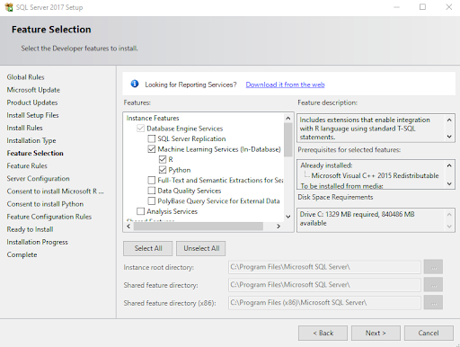

```{r setup, include=FALSE}
knitr::opts_chunk$set(echo = FALSE)
```

# SQL SERVER<br>MACHINE LEARNING<br>SERVICES {.title_slide .center}
Tyler Bradley

<aside class="notes">
I initially gave this presentation in November 2020 for the Asheville SQL Meetup. It covers the basics of SQL Server's Machine Learning Services. Hopefully, it provides enough information to help people decide if this tech is a good solution for them.
</aside>

# Agenda {.normal_slide}
<div style="margin-top: 7%; margin-bottom: 15%;">
- Background
</div>
<div style="margin-bottom: 15%;">
- Demos
</div>
<div>
- Tips and Tricks
</div>

<aside class="notes">
This presentation covers some background on Machine Learning Services, like what it is and why you would want to use it. There's a demo section that showcases three different ways to use R in production with SQL Server. Finally, there's a section for some tips and tricks that helped me when I set up and use this tech.
</aside>

# Background {.section_slide .center}

<aside class="notes">
The first section is just on the background.
</aside>

# What is this? {.normal_slide}
<div class="fragment" style="margin-top: 7%; margin-bottom: 15%;">
- SQL Server feature to bring analytics into the database
</div>
<div class="fragment" style="margin-bottom: 15%;">
- R (2016) and Python (2017)
</div>
<div class="fragment">
- Not a standalone server (there is another option for that)
</div>

<aside class="notes">
Machine Learning Services is a SQL Server feature that allows you to bring analytics into the database by running the analytics programming language in-database. It first started in 2016 with R and later added Python support. Some old documentation will call it R services because that was the name before adding Python. This is not a standalone server. It's a regular SQL Server with added features. There is another option for a standalone server. That might be a better choice for your needs, but we'll not cover that in this presentation.
</aside>

# Use cases {.normal_slide}
<div class="fragment" style="margin-top: 7%; margin-bottom: 10%;">
- Forecasting next month’s revenue
</div>
<div class="fragment" style="margin-bottom: 10%;">
- Customer churn
</div>
<div class="fragment" style="margin-bottom: 10%;">
- Finding potential fraud
</div>
<div class="fragment">
- Basically, anything that is a best guess or probability
</div>

<aside class="notes">
If you're wondering if this would be a good addition to your tech stack, here are some excellent use cases: forecasting next month's revenue, customer churn to predict when types of customers are mostly like to leave, and finding potential fraud in claims data. Basically, anything that is a best guess or probability. It's not for pulling data or summaries. You can do that, but it won't be better than using SQL typically. You can do some predictive modeling with just SQL, but usually, using R or Python has more features and is easier to use. Also, for this presentation, when I say 'model', I'm talking about a predictive or statistical model, not a data model that's commonly used in SQL settings.
</aside>

# Why would you want this? {.normal_slide}
<div class="fragment" style="margin-top: 15%;">
- Speed up predictive model processing
  <div class="fragment sub_bullet">
     - The analysis has been brought to the data instead of bringing the data to the analysis
  </div>   
  <div class="fragment sub_bullet">
     - Utilizes SQL for data prep and R/Python for analysis
  </div>   
  <div class="fragment sub_bullet">
     - Outputs directly into SQL Server
  </div>   
</div>

<aside class="notes">
Speeding up predictive model processing is the main reason to add this tech. By bringing the analysis to the data, you don't have to move large data sets out of SQL Server to get the results you need. This can cut out a huge amount of time and processing power. You get to utilize SQL for the data prep and R or Python for the analysis. This brings you the best of both worlds. SQL tends to be a lot more stable and optimized for data prep, while R and Python can handle the large machine learning models that would too difficult to code in SQL. Also, Machine Learning Services outputs within SQL Server, which is easily used for reporting or an ETL. 
</aside>

# Why would you want this? {.normal_slide}
<div class="fragment" style="margin-top: 15%;">
- Clean up analytics projects in production
  <div class="fragment sub_bullet">
     - Use stored procedures, jobs, and other SQL objects
  </div>   
  <div class="fragment sub_bullet">
     - Less data pipeline work
  </div>   
  <div class="fragment sub_bullet">
     - Variety of setups but can be standardized across a team/organization
  </div>   
</div>

<aside class="notes">
This setup also allows you to have clean analytics projects in production. There's no need for large wonky code sets to get everything glued together. You can use all the standard SQL objects, like stored procedures and jobs. So, you don't need another tool for scheduling or error reporting. There is less pipeline work since you're not moving data in and out of SQL Server. So there are fewer ETLs, permissions issues, and other places for things to break. 

I think the addition of 'fewer things to break' for this work is an important selling point. If you're adding in tech, then you're also adding in more options for failure. That's made up for to get the predictive modeling capabilities but reducing all the other code helps put this option ahead of other predictive modeling tools.

There are a variety of setups, but you can pick a specific one for your team or organization. The flexibility is nice, so this tool works for most companies. Then when you get a setup for your team, you can set standards, so everything follows a pattern for documentation and code.
</aside>

# Why would you want this? {.normal_slide}
<div class="fragment" style="margin-top: 15%;">
- Ease collaboration between data scientists and DBAs
  <div class="fragment sub_bullet">
     - Utilized SQL permissions
  </div>   
  <div class="fragment sub_bullet">
     - Microsoft approved security
  </div>   
  <div class="fragment sub_bullet">
     - Options for resource controls
  </div>   
</div>

<aside class="notes">
This tech is a great setup because it can ease collaboration between data scientists and DBAs. It utilizes SQL permissions. So no one needs to learn a new setup for that, and it can fit nicely into your current structure. It has Microsoft-approved security. You're not bringing in unvalidated software on your server. And it has options for resource controls. If you're worried about data science work taking over everything, you can put up gates to prevent that. As a side note, I've never needed to use this feature. Most resource-intensive data science work happens during development, not running them in production, and I build the models in a different environment. 
</aside>

# Why would you NOT want this? {.normal_slide}
<div class="fragment" style="margin-top: 7%; margin-bottom: 15%;">
- ‘Real-time’ analysis is too slow
</div>
<div class="fragment" style="margin-bottom: 15%;">
- Big data operations are too small
</div>
<div class="fragment">
- Power BI (and other software) interfaces
</div>

<aside class="notes">
The real-time analysis can be too slow. We'll compare different options during the demo section, so you'll see the fast ones. If you can wait a few seconds to return results or run everything in a batch the night before you need them, you're good to go. If machine learning services are too slow, then SQL Server is probably too slow.

The big data operations can be too small. This is more of a limitation of SQL Server again. Depending on your data size, this might not be big enough, but then SQL Server is probably not the right tool anyways.

This doesn't work as well with Power BI and other interfaces as you might expect, especially for interactivity. If you can't run a stored procedure or run all the options before pulling out the data, you'll have a lot of limitations here.
</aside>

# Planning {.normal_slide}
<div class="fragment" style="margin-top: 7%; margin-bottom: 15%;">
- Roles - DBA/Data Engineer to Data Scientist/Analyst
</div>
<div class="fragment" style="margin-bottom: 15%;">
- Use cases
</div>
<div class="fragment">
- Number of People
</div>

<aside class="notes">
When you're planning out setting this up, there are a few things to figure out. You should have some idea of the roles you want involved. Machine learning services gives teams a whole spectrum of responsibilities that can be used to set expectations and tasks between DBAs and data scientist. So, you can have a setup with a ton of DBA involvement or very little work, depending on what you want at your company. You'll want to know about the use cases you'll have. In the demo section, we'll walk through a few options. Determining which setup is best for your team is pretty much determined by your use cases. The number of people involved can also play a factor. You can easily interfere with other people's work if you're not careful, so some setups are better with larger teams. Overall, there is a lot of flexibility but no strong consensus on how to use this tech.
</aside>

# Demos {.section_slide .center}

<aside class="notes">
Now for the demo section.
</aside>

# Install {.normal_slide}
::: {.container}
:::: {.col}

::::
:::: {.col}

::::
:::

<aside class="notes">
You need to have SQL Server installed first. I'm using the 2017 Developer Edition. You'll go through normal installation for most of this. (https://www.microsoft.com/en-us/sql-server/sql-server-2017 - ‘Free download’ link near the bottom)
</aside>

# Install {.normal_slide}
::: {.container}
:::: {.col}
<div style="position: relative" >
   
   
</div>
::::
:::: {.col}
<div style="position: relative" >
   
   
</div>
::::
:::

<aside class="notes">
The main catch is making sure to check the boxes for Machine Learning Services (In-Database). You can pick R, Python, or both.

Do not pick Machine Learning Server (Standalone). That's a different product.
</aside>

# Install {.normal_slide}
::: {.container}
:::: {.col}
<div style="margin-top: 25%;">
A few more options and restarts later... 
</div>
::::
:::: {.col}

::::
:::

<aside class="notes">
You'll go through a few more options and restarts. You can test that it's working with a little 'Hello World' script.
</aside>

# sp_execute_external_script {.normal_slide}
<div class="fragment" style="margin-top: 7%; margin-bottom: 10%;">
- This is the main function for using an external language (R/Python)
</div>
<div class="fragment" style="margin-top: 15%;">
- Main parameters are:
  <div class="sub_bullet">
     - Language
  </div>   
  <div class="sub_bullet">
     - Script
  </div>   
  <div class="sub_bullet">
     - Input data
  </div>   
  <div class="sub_bullet">
     - Output data
  </div>  
  <div class="sub_bullet">
     - (Other parameters too)
  </div>  
</div>

<aside class="notes">
The primary function you'll use is sp_execute_external_script. It's the way to access an external language. There are a bunch of parameters. The specific language (R or Python). The actual script to run. The input data set. The output data that gets returned. And a lot of other options too.
</aside>

# !!!!DISCLAIMER!!!! {.normal_slide .center style='text-align: center;'}
<div style="margin-top: 7%; text-align: center;">
There will be code that creates predictive models here.  It is cheating.  DO NOT FOLLOW IT.  It does not cover choosing a model, testing/validation sets, and checking model assumptions. 
</div>
<div style="margin-top: 7%; text-align: center;">
The SQL objects and functions are totally fine and can be used.
</div>

<aside class="notes">
For a big disclaimer. I'll run some code that creates predictive models, but I'm taking a lot of shortcuts. I'm not working through choosing a model, testing, and checking. I'm just getting a small model setup for the demo. The SQL objects and functions are fine to use. That's the main focus of this presentation and can be adapted very easily for your company.
</aside>

# Model: SQL Server / R Demo {.normal_slide .center}

<aside class="notes">
-- run 1_set_up_checks.sql

This shows that everything looks good.

-- run 2_create_mtcars.sql

This builds out a test data set for us to use.

-- run 3_mtcars_sql.sql

This builds a model, saves it to a new table, and scores data with the new model. You can add more models to this table or update the existing ones.

This is the most basic setup. Everything's pretty much kept in SQL Server with basic functionalities.
</aside>

# Native Scoring {.normal_slide}
<div class="fragment" style="margin-top: 7%; margin-bottom: 10%;">
- This doesn’t use the overhead of R/Python by saving the models in ONNX or a predefined binary format.
</div>
<div class="fragment" style="margin-bottom: 10%;">
- There is a list of possible models defined in specific functions. (rx…)
  <div class="sub_bullet">
     - RevoScaleR
  </div>   
  <div class="sub_bullet">
     - revoscalepy
  </div>   
</div>
<div class="fragment">
- Uses the PREDICT function
</div>

<aside class="notes">
There is an option for Native Scoring. This doesn't use the overhead of R and Python but uses another format. The trade-off is there is a smaller list of possible models, but these are the most common. You'll use RevoScaleR or revoscalepy, depending on if you're using R or Python. The main function here is PREDICT. So look for that in the code.

(Open Neural Network Exchange (ONNX))
</aside>

# Native Scoring Demo {.normal_slide .center}

<aside class="notes">
-- run 4_mtcars_nativescoring.sql

This builds the model, adds it to the table, and scores some data. You can see it is very similar to the other setup.
</aside>

# R Package {.normal_slide}
<div class="fragment" style="margin-top: 7%; margin-bottom: 10%;">
- Standard way of wrapping up R models
</div>
<div class="fragment" style="margin-bottom: 10%;">
- Provides more separation between R and SQL
  <div class="sub_bullet">
     - Change packages to change models
  </div>   
  <div class="sub_bullet">
     - Use ALTER statement to update package
  </div>   
</div>
<div class="fragment">
- Cleanest route for when a lot of R code needs to be ran
</div>

<aside class="notes">
The last way to run a model in production I'll talk about is using an R package. R packages are a pretty common mechanism to wrap up a lot of R code. You'll see them for almost everything. This provides the most separation between R and SQL by wrapping up most of the R code in the package then using SQL to pass data to it. You can make changes to the package to change the model instead of changing any SQL code. You'll just need to use an ALTER statement to update it. This is probably the cleanest route for when a lot of R code needs to run.
</aside>

# R Package {.normal_slide}
<div class="fragment" style="margin-top: 15%;">
- There are some small details
  <div class="sub_bullet">
     - Sys.setenv(R_DEFAULT_SAVE_VERSION = 2) (if SQL < 3.5 but package isn’t)
  </div>   
  <div class="sub_bullet">
     - Sys.setenv(R_DEFAULT_SERIALIZE_VERSION = 2) (if SQL < 3.5 but package isn’t)
  </div>   
  <div class="sub_bullet">
     - devtools::build(binary = TRUE) (SQL Server wants zip)
  </div>   
</div>

<aside class="notes">
When you're creating a model to use in a package, there might be some versioning issues. Using these settings might resolve them.
</aside>

# R Package Demo {.normal_slide .center}

<aside class="notes">
-- run 5_mtcars_rpackage.sql

--(Make sure to have the package pulled from GitHub and saved in as a zipfile.)

This code uploads an R package that contains a pre-built model. It then uses machine learning services to score data with that package.
</aside>

# Speed Comparison Demo {.normal_slide .center}

<aside class="notes">
-- run 6_mt_cars_big.sql

This code builds out a bigger data set to see run time comparisons. It's good for a lot of batch analytics, and the native scoring is the best.
</aside>

# Tips and Tricks {.section_slide .center}

<aside class="notes">
Now for the tips and tricks section.
</aside>

# Tips and Tricks {.normal_slide}
<div class="fragment" style="margin-top: 7%; margin-bottom: 10%;">
- Small catches will be the most painful part
  <div class="fragment sub_bullet">
     - R/Python are case sensitive.  So the input data names have to match
  </div>   
  <div class="fragment sub_bullet">
     - Input/output formats are troublesome
  </div>   
  <div class="fragment sub_bullet">
     - Error messaging can be cloudy at best
  </div>   
</div>
<div class="fragment">
- There is a whole world of versioning
  <div class="fragment sub_bullet">
     - Upgrading Machine Learning Services
  </div>   
  <div class="fragment sub_bullet">
     - miniCran/R Open/checkpoint package
  </div>   
  <div class="fragment sub_bullet">
     - Dependencies
  </div>   
</div>

<aside class="notes">
Small catches and errors will definitely be the most painful part. You'll hit a lot of minor mistakes the first time you try to get something working. Here are a few to watch out for in your work. R and Python are case-sensitive.  So the input data names have to match exactly, unlike SQL. Input/output formats can trouble. This includes the number of columns, names, and data types. R, Python, and SQL Server have slightly different data types. So, you might hit a weird issue, especially with conversions. Error messaging can be cloudy at best. You'll get a lot of weird messages that are either a downstream effect of the real problem or are just some esoteric response. You can get this if there's something wrong in the R code, but you'll get the final issue as a SQL problem.

There is also a whole world of versioning that we won't get to in this presentation. You'll need to look into upgrading versions of Machine Learning Services. Probably choose something using miniCran, R Open, and the checkpoint package. Finally, you'll need to figure out any dependencies for the packages of predictive models you might have. The tech on the last bullet point can help you out here.
</aside>

# Tips and Tricks {.normal_slide}
<div class="fragment" style="margin-top: 7%; margin-bottom: 10%;">
- Documentation/Blogs are hit-or-miss
</div>
<div class="fragment" style="margin-bottom: 10%;">
- Azure Data Science VM (other sandboxes)
</div>
<div class="fragment">
- Use all the standard SQL objects/tools
  <div class="fragment sub_bullet">
     - Wrap everything in a stored procedure
  </div>   
  <div class="fragment sub_bullet">
     - Save/update models in a temporal table
  </div>   
  <div class="fragment sub_bullet">
     - Separate database or bundled by project
  </div>   
</div>

<aside class="notes">
A lot of documentation and blog posts are hit or miss because they deal with outdated practices or features that don't work with your setup. If you search around enough, you will find some help eventually though.

You can use all the standard SQL objects/tools. Everything can be wrapped up in a stored procedure, which can be very nice. You can save and update models in a temporal table to compare model performance over time. And you can use a separate for all models or a different database for each project to keep data pulls, reference tables, and outputs altogether.
</aside>

# Tips and Tricks {.normal_slide}
<div class="fragment" style="margin-top: 7%; margin-bottom: 15%;">
- Write documentation as you go. Then delete and restart following the documentation
</div>
<div class="fragment">
- Script everything
  <div class="fragment sub_bullet">
     - sqlmlutils package for R users
  </div>   
  <div class="fragment sub_bullet">
     - Standard SQL for SQL users
  </div> 
</div>

<aside class="notes">
Make sure to write documentation as you go. Then at the end, delete the setup and restart following the documentation. You'll probably want to delete and restart several times. There will be little catches you'll need to remember later, and having them written down will save you.

I like to script everything. I find it easier for reproducibility and to pass off stuff to coworkers. If you mainly have an R shop, the sqlmlutils package will be helpful. If you're mainly SQL, you can use standard SQL code for everything. At my job, everything gets passed off to another developer for putting models on our production server. I've got scripts that pick up the R packages, place them in the right spot, and test everything.
</aside>

# Tips and Tricks {.normal_slide}
<div class="fragment" style="margin-top: 7%;">
- Restarting the Launchpad
</div>


<aside class="notes">
Lastly, sometimes in development Machine Learning Services will stop working. The main place to check is restarting the launchpad. This will fix it most of the time. There's nothing really special about this slide. Just to know to do this because you'll almost definitely run into this issue.
<aside class="notes">
</aside>

# End {.section_slide .center}

<aside class="notes">
End.
</aside>